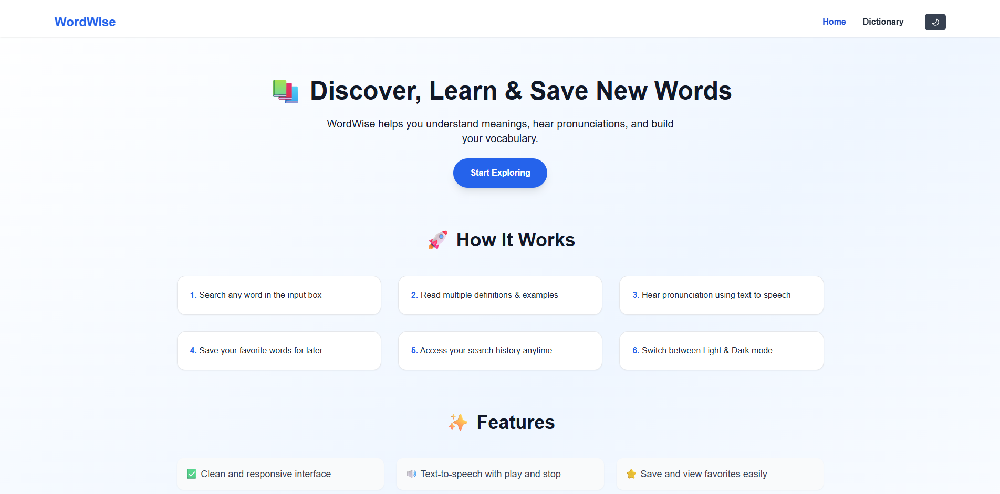
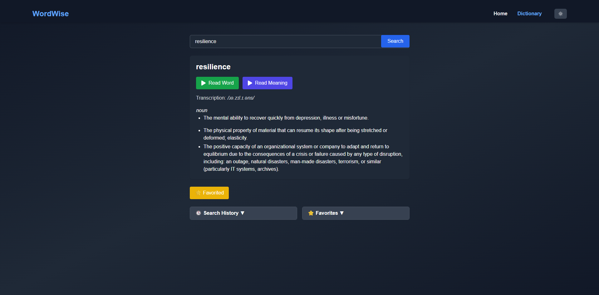

# WordWise 🧠📚

**WordWise** is a modern and responsive web app that helps users learn new words, understand their meanings, pronunciations (IPA transcription), and see how they're used in sentences. Built with React, Vite, Tailwind CSS, and powered by dictionary APIs, WordWise is designed for learners, readers, and language enthusiasts who want to expand their vocabulary in a simple, elegant interface.

## ✨ Features

- 🔍 **Search any word** to get:
  - Definitions
  - Transcriptions (IPA)
  - Usage examples
- 🌗 **Light/Dark theme toggle** with persistence
- 📱 **Fully responsive design** for mobile and desktop
- 🍔 **Mobile navigation menu** with animated modal
- 💬 **Smooth UI animations** with Framer Motion
- ⚡️ Fast, clean, and user-friendly interface

## 📸 Screenshots




## 🛠️ Tech Stack

- **Frontend:** React, Vite, Tailwind CSS
- **Icons:** React Icons
- **Animations:** Framer Motion
- **Routing:** React Router DOM
- **API:** [Free Dictionary API](https://dictionaryapi.dev/)

## 🚀 Getting Started

### Prerequisites

- Node.js & npm installed

### Installation

```bash
git clone https://github.com/Dev-Rodiyat/WordWise.git
cd WordWise
npm install
````

### Running the App

```bash
npm run dev
```

Visit: `http://localhost:5173` or as configured by your dev server.

## 🔧 Project Structure

```
src/
├── components/     // Reusable UI components (Header, Footer, etc.)
├── pages/          // Page components (Home, Dictionary, etc.)
├── modals/          // Nav modal for small screens
├── App.jsx         // App routes and layout
├── main.jsx        // Entry point
└── index.css       // Tailwind base styles
```

## 📦 API Usage Example

You can use [DictionaryAPI.dev](https://dictionaryapi.dev/) or any other dictionary API to fetch word data:

```bash
GET https://api.dictionaryapi.dev/api/v2/entries/en/<word>
```

## 💡 Future Improvements

* 🔊 Add pronunciation audio playback
* 📝 Save searched words as favorites
* 🌍 Support for multiple languages
* 🔎 Autocomplete suggestions

## 🧑‍💻 Author

**\[Rodiyat Olajide]**
Feel free to connect on [LinkedIn](https://www.linkedin.com/in/rodiyat-olajide-71b737329/), [X](https://x.com/Dev_Rodiyat) or check more projects on [GitHub](https://github.com/Dev-Rodiyat).
